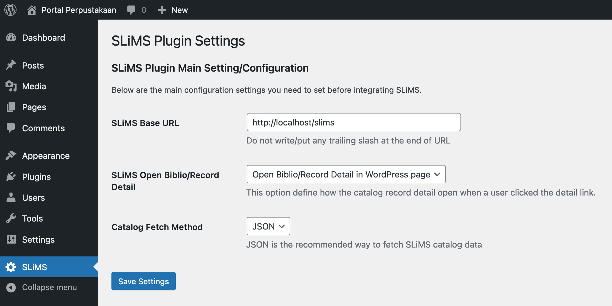
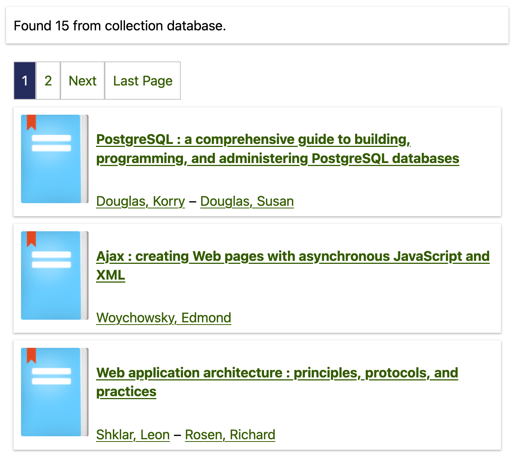
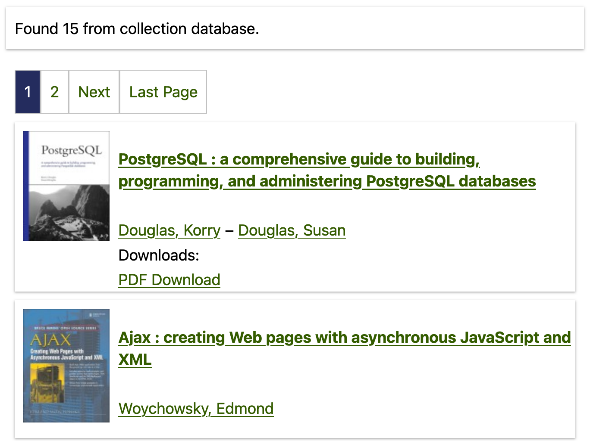
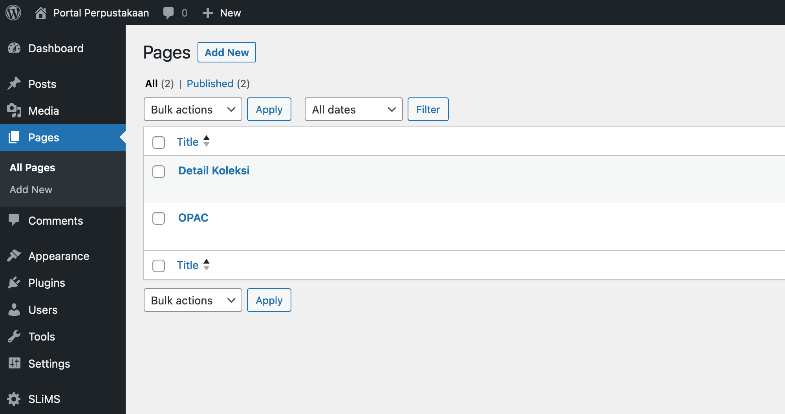
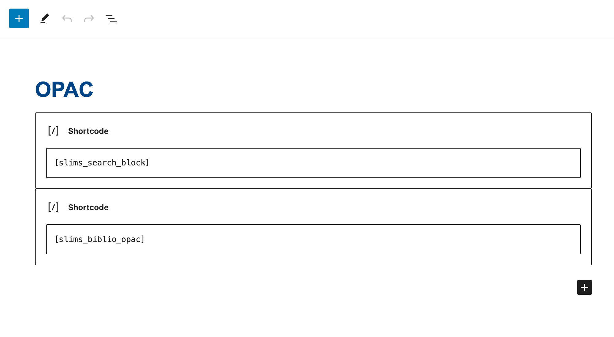

# SLiMS WordPress Plugin (SLiMS-WP)
SLiMS WordPress plugin enable you to integrate SLiMS catalog into WordPress CMS.
This plugins currently support WordPress up to 6.3.x and SLiMS 9 (Bulian).

## Installation
1. Copy the .zip file into the `wp-content/plugins` folder of your WordPress installation, or upload the .zip via the Upload menu in the WordPress Plugins management page.
2. Activate the plugin by clicking on the Activate button
3. After successful activation, go to the SLiMS setting page by clicking on the SLiMS menu on the WordPress Dashboard's sidebar

### SLiMS settings

**SLiMS Base URL**
The most important setting is the `SLiMS Base URL`. Write the full base URL of your SLiMS installation in this part. Make sure your SLiMS URL is accessible and the MODS/JSONLD catalog mode is enabled (all SLiMS installation activate this feature by default).

**SLiMS Open Biblio/Record Detail**
This setting provides option to open the record detail (or the book detail) in the WordPress site or in the SLiMS site.

**Catalog Fetch Mode**
This setting determine the method the SLiMS-WP plugins fetch/take data from the SLiMS. The JSON method is relatively faster since the data size is lighter than the XML method. The XML method on the other side provides richer data dan JSON data. You can see the comparison between mode below.

**Using JSON**

**Using XML**

### Where Can I See The OPAC/Catalog?
The SLiMS-WP automatically create *OPAC* page in the installation process, where you can add this page to your WordPress navigation menu. The slug for the *OPAC* page is `biblio-opac`. For example, if your WordPress URL is `http://mylibrary.lib`, then the *OPAC* can be accessed through the `http://mylibrary.lib/biblio-opac/`. DO NOT DELETE the SLiMS-WP *OPAC*! 

### Shortcodes
The SLiMS-WP plugin provides three shortcodes that you can use in any page (the *OPAC* page is actually uses these shortcodes!).

`[slims_search_block]` : print out SLiMS-WP's search form block where user can write search keywords. You can put this, for example in the WordPress front page.

`[slims_biblio_opac]` : print out SLiMS-WP's list of biblio/records along with its pagination.

`[slims_new_titles]` : print out SLiMS-WP's new titles. You can use this to show new titles in the front page.

